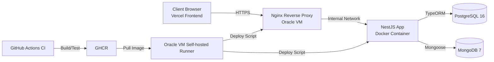

# Learniverse

온라인 교육 플랫폼을 위해 Nest.js로 구현한 백엔드 API 서버입니다.

## 프로젝트 소개

### 기획 배경

기존 학습 서비스는 단순 CRUD 구현에 머무르는 경우가 많아, 실제 운영에서 중요한 문제(동시성, 중복 요청, 배포 안정성, 관측성)를 놓치기 쉽습니다.

Learniverse는 다음 문제를 해결하는 것을 목표로 설계되었습니다.

- 강의/수강/과제 도메인의 일관된 API 제공
- 동시 요청 상황에서 데이터 정합성 보장
- 재시도 요청(네트워크 불안정, 더블 클릭)에서도 안전한 멱등 처리
- VM 단일 환경에서도 운영 가능한 배포 자동화(CI/CD + 컨테이너)

### 배포 URL
- Frontend (Vercel): `https://learniverse-client-alpha.vercel.app/`
- Backend API: `https://api.learniverse.store`
- Swagger: `https://api.learniverse.store/docs`
- Health Check: `https://api.learniverse.store/api/v1/health`

## 기술 스택

### Backend
- Node.js 22
- TypeScript 5.7
- NestJS 11
- TypeORM 0.3
- PostgreSQL 16
- MongoDB 7 + Mongoose 9
- JWT (Access/Refresh)
- Jest / Supertest / Testcontainers

### Infra / DevOps
- Docker / Docker Compose
- Nginx (Reverse Proxy)
- Let’s Encrypt + Certbot (TLS)
- GitHub Actions (CI/CD)
- GHCR (Container Registry)
- Oracle Cloud VM (Self-hosted runner)

## 주요 기능

### 핵심 기능 목록
- 인증/인가
  - 회원가입, 로그인, 토큰 재발급, 로그아웃
  - 역할 기반 권한(`student`, `tutor`)
- 강의/레슨
  - 튜터의 강의 생성/수정/삭제
  - 레슨(강의 하위 리소스) 관리
  - 공개 강의 목록/상세 조회
- 수강 신청/진도
  - 수강 신청, 내 수강 목록 조회
  - 진도율 업데이트(동시성 고려)
- 과제/제출/피드백
  - 튜터 과제 출제/공개
  - 학생 과제 제출
  - 튜터 피드백/채점
- 안정성 강화 로직
  - `Idempotency-Key` 기반 중복 요청 방지
  - 진행률 업데이트 시 비관적 락 적용
  - 글로벌 예외 필터/응답 인터셉터/요청 로깅

## ④ 시스템 아키텍처

### 전체 구조도



### 배포 환경 설명
- 단일 Oracle Cloud VM에서 Docker Compose로 운영
- 외부 공개 포트: `80/443` (Nginx)
- 앱/DB 포트는 내부 네트워크로만 사용
- 배포 파이프라인
  1. `main` push
  2. GitHub Actions에서 lint/test/build
  3. GHCR 이미지 push
  4. self-hosted runner가 VM에서 pull + migration + compose up
- TLS 인증서
  - 초기 발급: `scripts/init-letsencrypt.sh`
  - 갱신: `scripts/renew-letsencrypt.sh` (cron 권장)

### 프로덕션 컨테이너 구성 원칙
- 일반적인 프로덕션은 **하나의 컨테이너에 모든 프로세스(Nginx, App, DB)를 함께 넣지 않습니다.**
- 권장 원칙은 `1 컨테이너 = 1 역할`입니다.
  - Reverse Proxy/TLS: `nginx`
  - API Runtime: `app` (NestJS)
  - 데이터 저장소: `postgres`, `mongodb`
- 이 프로젝트도 Docker Compose에서 위 역할을 분리해 운영합니다.
- 분리 이유
  - 장애 격리: 앱 장애가 DB/프록시에 전파되지 않음
  - 운영 단순화: 배포/재시작/모니터링 단위 분리
  - 확장 유연성: 트래픽 증가 시 앱 계층부터 수평 확장 가능

### 1GB VM 운영 한계 및 권장 사양
현재 스택(`nginx + nest + postgres + mongodb`)은 1GB VM에서도 기동은 가능하지만, 안정적인 운영 여유가 매우 적습니다.

| 구성 요소 | 대략 메모리 사용량 |
|---|---|
| Nginx | 20~50MB |
| NestJS App | 200~400MB |
| PostgreSQL | 150~300MB |
| MongoDB | 200~400MB |
| OS + Docker Daemon | 150~250MB |

- 합산 시 1GB에 근접하거나 초과할 수 있어, 배포/마이그레이션/트래픽 순간에 OOM 위험이 있습니다.
- 포트폴리오/저트래픽 환경: 1GB 운영 가능
- 실사용 안정성 기준: **최소 2GB 메모리 권장**
- 점검 명령어
  - `free -h`
  - `docker stats`
  - `dmesg -T | grep -i -E \"oom|killed process\"`

## ⑥ ERD

### 관계형 DB (PostgreSQL)

```mermaid
erDiagram
    USERS ||--o{ COURSES : "tutor_id"
    USERS ||--o{ ENROLLMENTS : "student_id"
    COURSES ||--o{ LECTURES : "course_id"
    COURSES ||--o{ ENROLLMENTS : "course_id"
    COURSES ||--o{ ASSIGNMENTS : "course_id"

    USERS {
      uuid id PK
      varchar email UK
      varchar password_hash
      varchar name
      enum role "student|tutor"
      boolean is_active
      varchar refresh_token NULL
      timestamp created_at
      timestamp updated_at
    }

    COURSES {
      uuid id PK
      varchar title
      text description
      enum category
      enum difficulty
      boolean is_published
      uuid tutor_id FK
      timestamp created_at
      timestamp updated_at
    }

    LECTURES {
      uuid id PK
      varchar title
      text content
      varchar video_url NULL
      int order
      uuid course_id FK
      timestamp created_at
      timestamp updated_at
    }

    ENROLLMENTS {
      uuid id PK
      uuid student_id FK
      uuid course_id FK
      enum status
      int progress
      timestamp created_at
      timestamp updated_at
    }

    ASSIGNMENTS {
      uuid id PK
      varchar title
      text description
      uuid course_id FK
      timestamp due_date NULL
      boolean is_published
      timestamp created_at
      timestamp updated_at
    }

    IDEMPOTENCY_KEYS {
      uuid id PK
      uuid user_id
      varchar method
      varchar path
      varchar idempotency_key
      varchar request_hash
      varchar status
      int response_status NULL
      jsonb response_body NULL
      timestamp expires_at
      timestamp created_at
      timestamp updated_at
    }
```

### 문서형 DB (MongoDB)

```mermaid
erDiagram
    SUBMISSIONS {
      ObjectId _id PK
      string studentId
      string assignmentId
      string content
      string[] fileUrls
      string status
      string feedback NULL
      number score NULL
      date reviewedAt NULL
      date createdAt
      date updatedAt
    }
```

> `submissions.studentId` / `submissions.assignmentId`는 PostgreSQL `users.id`, `assignments.id`를 논리적으로 참조합니다.

### 주요 인덱스
- PostgreSQL
  - `lectures(course_id, order)` unique
  - `enrollments(student_id, course_id)` unique
  - `assignments(course_id)` index
  - `idempotency_keys(user_id, method, path, idempotency_key)` unique
  - `idempotency_keys(expires_at)` index
- MongoDB
  - `submissions(studentId, assignmentId)` unique
  - `submissions(assignmentId)` index

## ⑦ API 명세

- Swagger (local): `http://localhost:3000/docs`
- Swagger (prod): `https://api.learniverse.store/docs`
- Global Prefix: `/api/v1`

---

## 로컬 실행

### 사전 요구사항
- Node.js 22
- npm
- PostgreSQL (`localhost:5432`)
- MongoDB (`localhost:27017`)
- Docker Desktop (선택: DB를 컨테이너로 띄울 때 권장)

> Docker는 앱 실행의 필수 조건이 아닙니다.  
> 다만 PostgreSQL/MongoDB가 실행 중이어야 Nest 서버가 정상 기동됩니다.

### DB를 Docker로 실행 (권장)

```bash
docker run -d --name learniverse-postgres \
  -e POSTGRES_USER=postgres \
  -e POSTGRES_PASSWORD=your_password_here \
  -e POSTGRES_DB=learniverse \
  -p 5432:5432 \
  postgres:16-alpine

docker run -d --name learniverse-mongo \
  -p 27017:27017 \
  mongo:7
```

### 앱 실행

```bash
# 1) 설치
npm install

# 2) 환경변수 설정
cp .env.example .env

# 3) 실행
npm run start:dev

# 4) 테스트 (단위)
npm run test

# 5) E2E 테스트 (Testcontainers 사용: Docker 필요)
npm run test:e2e
```

## 로컬 API 문서
- `http://localhost:3000/docs`
