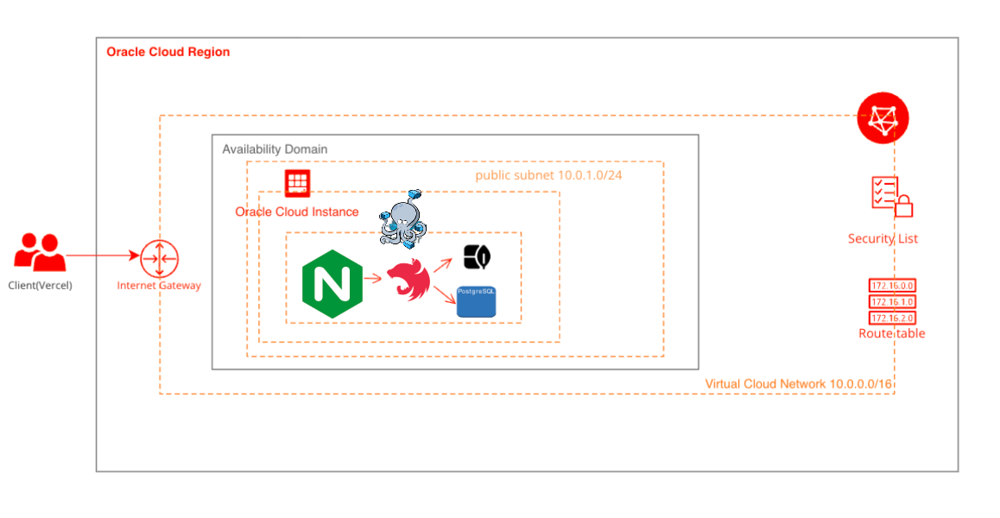
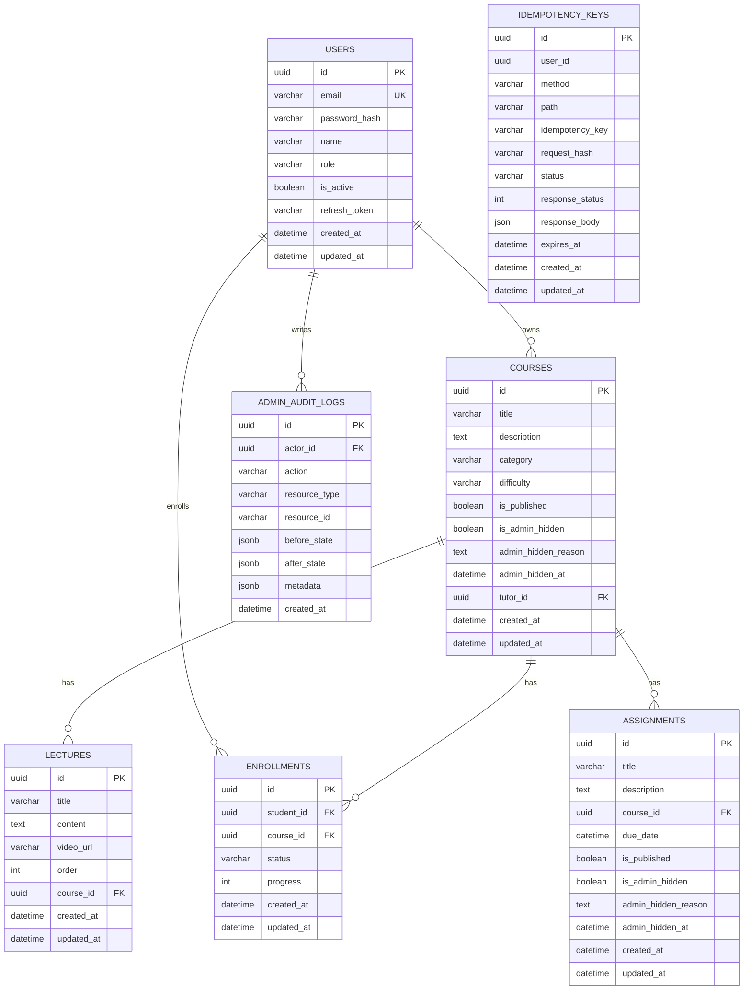
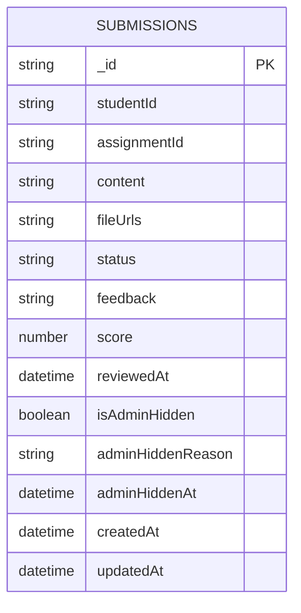

# Learniverse

학생, 튜터, 운영자가 함께 사용하는 온라인 학습 플랫폼의 백엔드 API 서버입니다.

## 한눈에 보기

- 역할: 개인 프로젝트 백엔드 설계 및 구현, 배포 자동화, 운영 API 설계
- 핵심 주제: 인증/인가, 수강/과제 도메인, 멱등 처리, 동시성 제어, 백오피스 API
- Frontend: `https://learniverse-client-alpha.vercel.app/`
- Backend API: `https://api.learniverse.store`
- Swagger: `https://api.learniverse.store/docs`
- Health Check: `https://api.learniverse.store/api/v1/health`

## 프로젝트 개요

Learniverse는 학생이 강의를 수강하고 과제를 제출하며, 튜터가 강의와 과제를 운영하고, 관리자가 사용자와 콘텐츠를 통제할 수 있는 온라인 학습 플랫폼입니다.

CRUD뿐만 아니라 아래 문제를 해결하는 데 초점을 두고 설계했습니다.

- 강의, 수강, 과제, 제출 흐름을 하나의 일관된 API로 제공
- 동시 요청이 들어와도 수강/진도 데이터 정합성을 유지
- 네트워크 재시도나 더블 클릭 상황에서도 멱등성을 보장

## 작업

- NestJS 기반 구조 설계
- 인증/인가 및 역할 기반 접근 제어 구현
- PostgreSQL + MongoDB 혼합 데이터 모델 설계
- `Idempotency-Key` 기반 중복 요청 방지 구현
- 수강 진도 업데이트의 비관적 락 처리 구현
- Docker Compose, Nginx, GH Actions, GHCR, Oracle Cloud VM 기반 배포 구성
- 관리자용 백오피스 API 설계 및 구현
- 단위 테스트, E2E 테스트, Playwright 기반 클라이언트 연동 검증

## 사용자 흐름

### 학생
- 회원가입 및 로그인
- 공개 강좌 목록/상세 조회
- 수강 신청
- 과제 제출

### 튜터
- 강좌 생성 및 공개
- 레슨/과제 관리
- 학생 제출 확인 및 피드백 제공

### 관리자
- 관리자 인증 경계로 로그인
- 사용자 상태/권한 관리
- 강좌/과제/제출물 moderation
- 감사 로그 및 운영 조회 API 사용

## 주요 기능

### 학습 플랫폼 기능
- 회원가입, 로그인, 토큰 재발급, 로그아웃
- 역할 기반 권한(`student`, `tutor`, `admin`)
- 튜터의 강의 생성/수정/삭제
- 레슨(강의 하위 리소스) 관리
- 공개 강의 목록/상세 조회
- 수강 신청, 내 수강 목록 조회
- 진도율 업데이트
- 과제 출제/공개, 제출, 피드백

### 안정성 강화 로직
- `Idempotency-Key` 기반 중복 요청 방지
- 진도율 업데이트 시 비관적 락 적용
- 글로벌 예외 필터, 응답 인터셉터, 요청 로깅

### 백오피스
- 관리자 인증 경계
- 감사 로그
- 사용자 운영 API
- 콘텐츠 moderation API
- 운영 조회 API

## 기술 스택

### Backend
- Node.js 22
- TypeScript 5.7
- NestJS 11
- TypeORM 0.3
- PostgreSQL 16
- MongoDB 7 + Mongoose 9
- JWT (Access/Refresh)
- Jest / Supertest / Testcontainers

### Infra / DevOps
- Docker / Docker Compose
- Nginx (Reverse Proxy)
- Let’s Encrypt + Certbot (TLS)
- GitHub Actions (CI/CD)
- GHCR (Container Registry)
- Oracle Cloud VM (Self-hosted runner)

## 시스템 아키텍처

### 전체 구조도



### 구조 설명
- Frontend는 [Vercel](https://learniverse-client-alpha.vercel.app/)에서 동작하고, API 요청은 Nginx를 통해 Nest 앱으로 전달됩니다.
- Nest 서버는 관계형 데이터는 PostgreSQL에, 제출물 문서는 MongoDB에 저장합니다.
- 프로덕션은 Docker Compose로 `nginx`, `app`, `postgres`, `mongodb`를 분리해 운영합니다.
- 네트워크는 `edge`와 `internal`로 분리합니다.
  - `edge`: `nginx`, `app`
  - `internal`: `app`, `postgres`, `mongodb`
- 외부 공개 포트는 `80/443`만 사용하고, `3000`, `5432`, `27017`은 외부에 열지 않습니다.

### 프로덕션 컨테이너 구성 원칙
- `1 컨테이너 = 1 역할` 원칙을 사용합니다.
  - Reverse Proxy/TLS: `nginx`
  - API Runtime: `app`
  - 데이터 저장소: `postgres`, `mongodb`
- 분리 이유
  - 장애 격리
  - 운영 단위 단순화
  - 앱 계층 우선 확장 가능
  - DB와 앱 포트를 외부에 노출하지 않는 보안 경계 확보

### 배포 안정화 포인트
- `nginx`는 `app` healthcheck 통과 이후에만 기동합니다.
- 배포 순서는 `postgres/mongodb -> migration -> app -> app health -> nginx`로 고정합니다.
- `nginx` upstream은 Docker DNS(`127.0.0.11`)를 사용해 `app` 컨테이너 IP 변경에 대응합니다.
- 이 설정으로 배포 중 `stale upstream`, `502`, `CORS처럼 보이는 upstream 장애` 가능성을 낮췄습니다.

## 테스트와 신뢰성

### 테스트 전략
- 단위 테스트: 서비스, 컨트롤러, 정책, 인증 로직 검증
- E2E 테스트: `Jest + Supertest + Testcontainers`로 API 흐름 검증
- 클라이언트 연동 검증: Playwright 기반 admin/user flow 점검

## 배포와 운영

### 배포 환경 설명
- 단일 Oracle Cloud VM에서 Docker Compose로 운영
- 외부 공개 포트: `80/443` (Nginx)
- 앱/DB 포트는 내부 네트워크로만 사용
- 배포 파이프라인
  1. `main` push
  2. GitHub Actions에서 lint/test/build
  3. GHCR 이미지 push
  4. self-hosted runner가 VM에서 pull + migration + compose up

### 운영 판단
- 현재 스택(`nginx + nest + postgres + mongodb`)은 1GB VM에서도 기동은 가능하지만 운영 여유가 작습니다.
- 따라서 메모리 사용량, OOM 가능성, 컨테이너 역할 분리를 기준으로 운영 구조를 판단했습니다.
- 또한 포트폴리오 및 저트래픽 시연 환경을 전제로 하므로 1GB Oracle VM으로도 시작 가능하다고 판단했습니다.

| 구성 요소 | 대략 메모리 사용량 |
|---|---|
| Nginx | 20~50MB |
| NestJS App | 200~400MB |
| PostgreSQL | 150~300MB |
| MongoDB | 200~400MB |
| OS + Docker Daemon | 150~250MB |

- 합산 시 1GB에 근접하거나 초과할 수 있어, 배포/마이그레이션/트래픽 순간에 OOM 위험이 있습니다.
- 따라서 1GB는 포트폴리오/저트래픽 용도로는 수용 가능하지만, 운영 여유가 충분한 구성으로 보지는 않았습니다.

## 데이터 모델

- PostgreSQL
  - 사용자, 강좌, 레슨, 수강, 과제, 감사 로그, 멱등성 키 저장
  - 강좌/과제에는 moderation용 컬럼이 추가되어 있습니다.
- MongoDB
  - 제출물 문서를 저장
  - 제출물에도 moderation 필드가 추가되어 있습니다.

## ERD

### 관계형 DB (PostgreSQL)



### 문서형 DB (MongoDB)



> `submissions.studentId` / `submissions.assignmentId`는 PostgreSQL `users.id`, `assignments.id`를 논리적으로 참조합니다.

### 주요 인덱스
- PostgreSQL
  - `lectures(course_id, order)` unique
  - `enrollments(student_id, course_id)` unique
  - `assignments(course_id)` index
  - `idempotency_keys(user_id, method, path, idempotency_key)` unique
  - `idempotency_keys(expires_at)` index
  - `admin_audit_logs(actor_id)` index
  - `admin_audit_logs(created_at)` index
- MongoDB
  - `submissions(studentId, assignmentId)` unique
  - `submissions(assignmentId)` index

## API 명세

- Swagger (local): `http://localhost:3000/docs`
- Swagger (prod): `https://api.learniverse.store/docs`
- Global Prefix: `/api/v1`

## 로컬 실행

### 사전 요구사항
- Node.js 22
- npm
- PostgreSQL (`localhost:5432`)
- MongoDB (`localhost:27017`)
- Docker Desktop (선택: DB를 컨테이너로 띄울 때 권장)

> Docker는 앱 실행의 필수 조건이 아닙니다. 다만 PostgreSQL/MongoDB가 실행 중이어야 Nest 서버가 정상 기동됩니다.

### DB를 Docker로 실행 (권장)

```bash
docker run -d --name learniverse-postgres \
  -e POSTGRES_USER=postgres \
  -e POSTGRES_PASSWORD=your_password_here \
  -e POSTGRES_DB=learniverse \
  -p 5432:5432 \
  postgres:16-alpine

docker run -d --name learniverse-mongo \
  -p 27017:27017 \
  mongo:7
```

### 앱 실행

```bash
# 1) 설치
npm install

# 2) 환경변수 설정
cp .env.example .env

# 3) 실행
npm run start:dev

# 4) 테스트 (단위)
npm run test

# 5) E2E 테스트 (Testcontainers 사용: Docker 필요)
npm run test:e2e

# 6) 핵심 스모크 E2E
npm run test:e2e:smoke
```
